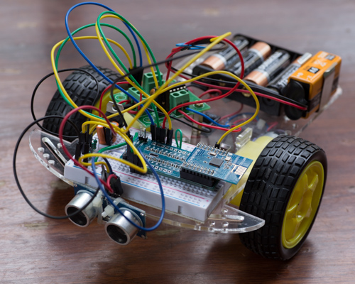

In this project, we will build a two wheeled robot based on the Nordic
nRF51822 BLE SoC. Motor control for the two wheels of the robot will
be done using an L293D chip. The robot can be controlled using any
mobile device that has BLE, and when not connected, it switches to an
autonomous mode, avoiding obstacles using an HC-SR04 ultrasonic
sensor.

Read more at:

[http://electronut.in/blebot][1]

[1]: http://electronut.in/blebot

